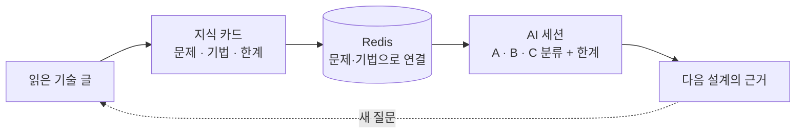
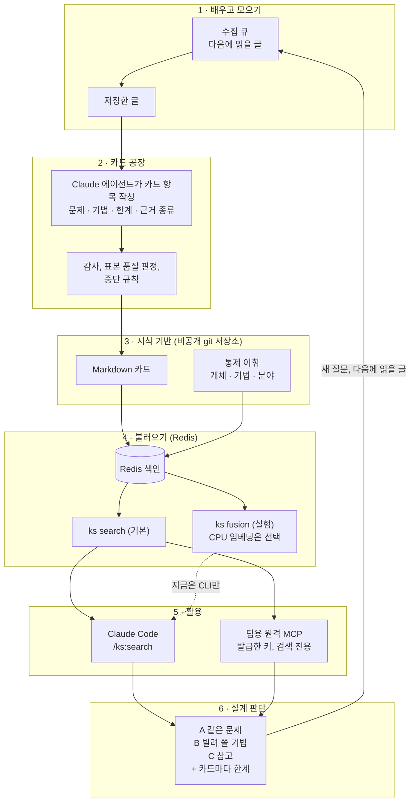
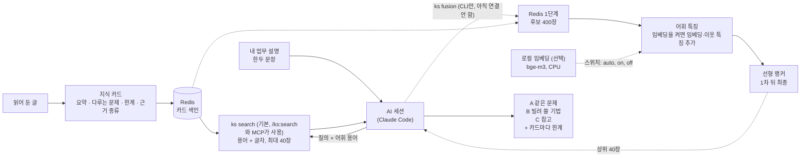

[English](README.md) | 한국어

# knowledge-scout

<!-- s:vision -->
> **한 번 읽고 잊힌 기술 글을, 다음 설계의 근거로 다시 불러옵니다.**

knowledge-scout는 개인이나 작은 팀이 쓰는 Redis 기반 지식 검색 시스템입니다. 중요한 기술 글일수록 정작 설계를 시작할 때는 떠오르지 않습니다. 이 시스템은 읽어 둔 글 가운데 지금 설계하는 일과 이어진 글을 찾아 근거로 내놓습니다.

엔진인 이 저장소는 공개하고 카드와 원문은 각자의 비공개 저장소에 둡니다. 지금은 macOS에서 동작하는 v0.2.0 릴리스 후보입니다. [빠른 시작](#빠른-시작)의 공개 샘플(카드 17장)로 바로 돌려 볼 수 있습니다.

<!-- s:concept -->
## 핵심 개념과 임팩트


```mermaid
flowchart LR
    A["읽은 기술 글"] --> B["지식 카드<br/>문제 · 기법 · 한계"]
    B --> C[("Redis<br/>문제·기법으로 연결")]
    C --> D["AI 세션<br/>A · B · C 분류 + 한계"]
    D --> E["다음 설계의 근거"]
    E -.->|"새 질문"| A
```

읽은 기술 글은 한 편마다 **지식 카드** 한 장이 됩니다. 카드에는 그 글이 다룬 문제·쓴 기법·한계·근거의 종류를 적습니다. 설계할 일을 한두 문장으로 적으면 Redis가 같은 문제나 기법으로 이어진 카드를 불러오고, AI 세션(Claude Code)이 그 카드를 **A** 같은 문제, **B** 빌려 쓸 기법, **C** 참고로 나눠 카드마다 한계를 붙여 다음 설계의 근거로 내놓습니다.

- **정밀도@10을 0.298에서 0.796으로 올렸습니다.** 정밀도@10은 상위 10장 가운데 관련 있는 카드의 비율입니다. 이전 `ks search` 엔진과 실험 랭커 `ks fusion`(선택 사항인 CPU 임베딩을 켠 경우)을 질의만 쓰는 검색에서 비교했고, 개발용으로 떼어 둔 질의 절반으로 잰 값입니다. 출시 기준으로 정한 0.80에는 아직 조금 못 미칩니다.
- **Redis와 CPU면 돌아갑니다.** GPU와 벡터 DB는 쓰지 않습니다.
- **매일 씁니다.** 저장해 둔 기술 글 약 19,600편이 검색 대상입니다.

<!-- s:story -->
## 왜 만들었나

저는 기술 글을 많이 읽습니다. 그런데 중요한 글일수록 다음 시스템을 설계하려고 앉은 그 순간에 떠오르지 않습니다. 이 문제를 다룬 글을 읽었다는 것까지는 기억납니다. 거기에 뭐라고 적혀 있었는지, 어디서 읽었는지가 기억나지 않습니다.

그래서 읽은 글을 자료로 등록해 두기로 했습니다. 맥락과 기술의 연결로 다시 찾을 수 있게 지식 기반을 쌓고, 앞으로 아키텍처나 시스템을 설계할 때 꺼내 쓰려는 것입니다.

이 시스템을 만들려고 Redis 글 한 편과 Ilyas Ibrahim의 Claude Code 에이전트 연재 3편을 직접 공부했습니다. 어느 글도 지식 검색 시스템은 다루지 않습니다. 아이디어는 에이전트가 맥락을 잃는 이야기를 읽다가 떠올랐습니다. 모델은 지금 컨텍스트 창에 있는 것만 보고 답합니다. 창 밖에 있는 것은 없는 것과 같습니다. Ilyas는 이를 "컨텍스트 건망증(context amnesia)"이라고 부릅니다. 읽은 글을 잊는 제 문제도 모양이 같았습니다.

이 글들에서 원리 여섯 개를 가져와 시스템에 하나씩 넣었습니다.

| 글에서 읽은 것 | 출처 | 이 시스템에서는 |
| --- | --- | --- |
| 메모리는 아키텍처 요구사항이다. 빠른 공유 저장소로 꺼내 둔다 | Redis 글 | 카드는 세션 밖에 두고 Redis에 색인한다 |
| Redis는 기억하는 층이지, 생각하는 층이 아니다 | Redis 글 | 불러오기는 Redis가, A·B·C 판정은 AI 세션이 한다 |
| 보고서를 다 읽지 말고 짧은 레지스트리를 읽는다 | Ilyas 2부 | 검색은 원문이 아니라 한 장짜리 카드를 읽는다 |
| 필요한 맥락만 골라 넣는다 | Ilyas 2부 | 세션은 돌려받은 후보(최대 40장)만 본다 |
| "끝냈다"는 말을 믿지 말고 결과를 확인한다 | Ilyas 2부 | 카드 생성 실행은 감사하고 표본을 판정한다. 검색 품질은 잰다 |
| 기준을 글로 적어 워크플로에 넣는다 | Ilyas 3부 | 카드 스키마와 통제 어휘를 고정한다 |

제가 한 일은 에이전트의 맥락을 지켜 주던 원리를 사람과 AI가 함께 설계하는 자리로 옮기고, 실제로 돌아가는 시스템으로 내려놓은 것입니다. 글은 모두 같은 항목을 가진 카드가 됩니다. 카드끼리는 개체·기법·분야로 짠 통제 어휘로 이어집니다. 그래서 배치 작업의 메모리 증가를 다룬 글이 로그 분석 업무에서 떠오를 수 있습니다. 둘이 같은 기법을 쓰기 때문입니다. 기억하는 일은 Redis가 맡습니다. 판단은 AI 세션이 돌려받은 카드만 읽고 내립니다.

**영감을 준 글**(아이디어만 빌렸고 코드는 가져오지 않았습니다. 시스템은 제가 직접 엮었습니다):
- [Redis as Agent Memory: Building Stateful AI Agents with Redis and LangChain](https://medium.com/gitconnected/redis-as-agent-memory-building-stateful-ai-agents-with-redis-and-langchain-3dcd191a4fc2): 에이전트 메모리를 바깥의 공유 저장소로 꺼내고 Redis를 기억하는 층으로 쓰는 방법.
- Ilyas Ibrahim, [How I Made Claude Code Agents Coordinate 100% and Solved Context Amnesia](https://medium.com/@ilyas.ibrahim/how-i-made-claude-code-agents-coordinate-100-and-solved-context-amnesia-5938890ea825): 컨텍스트 건망증을 실제로 겪은 기록. 에이전트들이 서로의 작업을 되풀이하다가 공유 레지스트리를 가진 메인 에이전트가 조율을 맡으면서 멈춘 과정.
- Ilyas Ibrahim, [The 4-Step Protocol That Fixes Claude Code Agent's Context Amnesia](https://medium.com/@ilyas.ibrahim/the-4-step-protocol-that-fixes-claude-codes-context-amnesia-c3937385561c): 레지스트리, 맥락 주입, 순서 정하기, 검증 게이트.
- Ilyas Ibrahim, [How to Build Production-Grade Systems with Claude Code without Context Drift](https://medium.com/@ilyas.ibrahim/how-to-build-production-grade-systems-with-claude-code-87f73dd311b9): 리뷰 체인과 글로 적어 워크플로에 넣은 기준.

<!-- s:overview -->
## 아키텍처 구조도

전체 시스템은 여섯 단계가 한 바퀴로 이어집니다. 저장한 글은 카드 공장을 거쳐 Markdown 카드가 됩니다. Redis가 카드를 색인하면 Claude Code나 팀용 원격 MCP가 그 카드를 불러 씁니다. 설계하다 생긴 새 질문은 다시 수집 큐로 들어갑니다.


```mermaid
flowchart TB
    subgraph S1["1 · 배우고 모으기"]
        Q["수집 큐<br/>다음에 읽을 글"] --> SA["저장한 글"]
    end
    subgraph S2["2 · 카드 공장"]
        CW["Claude 에이전트가 카드 항목 작성<br/>문제 · 기법 · 한계 · 근거 종류"] --> QC["감사, 표본 품질 판정,<br/>중단 규칙"]
    end
    subgraph S3["3 · 지식 기반 (비공개 git 저장소)"]
        CM["Markdown 카드"]
        VO["통제 어휘<br/>개체 · 기법 · 분야"]
    end
    subgraph S4["4 · 불러오기 (Redis)"]
        IX[("Redis 색인")] --> KS["ks search (기본)"]
        IX --> KF["ks fusion (실험)<br/>CPU 임베딩은 선택"]
    end
    subgraph S5["5 · 활용"]
        CC["Claude Code<br/>/ks:search"]
        MC["팀용 원격 MCP<br/>발급한 키, 검색 전용"]
    end
    subgraph S6["6 · 설계 판단"]
        DD["A 같은 문제<br/>B 빌려 쓸 기법<br/>C 참고<br/>+ 카드마다 한계"]
    end
    SA --> CW
    QC --> CM
    CM & VO --> IX
    KS --> CC & MC
    KF -.->|"지금은 CLI만"| CC
    CC & MC --> DD
    DD -->|"새 질문, 다음에 읽을 글"| Q
```

<!-- s:achieved -->
## 성과와 현재 위치

- 저장해 둔 기술 글 약 19,600편의 비공개 코퍼스로 매일 검색합니다. 아래 수치의 바탕이 된 카드는 공개하지 않습니다. 지금 배포하는 것은 `ks search`(Redis에서 어휘 용어와 글자로 찾고 모델은 쓰지 않음), Claude Code 플러그인(`/ks:search`, `/ks:add`), API 키로 쓰는 검색 전용 원격 MCP 서버입니다.
- Rust 랭커는 상위 40개의 ID와 점수가 JS 기준 구현과 100% 같습니다. 워크스페이스 테스트 361개도 통과합니다(커밋 a7cb2ab, `scripts/ks-redis-test.sh`).

<!-- s:quality -->
### 검색 품질과 측정 방법

정밀도@10은 상위 10장 가운데 판정자가 관련 있다고 본 카드의 비율입니다. 0~2 등급 중 1(일부 도움)이나 2(바로 답함)를 관련으로 셉니다. 판정이 없는 카드는 관련 없음으로 치므로 수치는 하한입니다. 아래는 비공개 검색 실험실에서 개발 절반 기준으로 잰 out-of-fold 수치입니다.

| 랭커 | 질의만 | 질의 + 용어 |
| --- | --- | --- |
| 이전 `ks search` 엔진 | 0.298 | 0.568 |
| 글자 n-gram BM25 | 0.508 | 0.684 |
| bge-m3 임베딩 단독 | 0.636 | 0.686 |
| `ks fusion`, CPU만(`--switch off`) | 0.744 | 0.794 |
| `ks fusion` + CPU 임베딩(`--switch on`) | 0.796 | 0.808 |
| 출시 기준 | 0.80 | 0.80 |

임베딩 행은 실제 임베딩을 켠 실행입니다(0.796이며, 캐시한 질의 벡터로는 0.802입니다. [docs/FUSION.md](docs/FUSION.md) 참고). 배포용 가중치는 개발 절반의 질의로 맞췄으므로, 이 표는 처음 보는 데이터에 대한 결과가 아니라 개발 절반 기준 out-of-fold 값입니다.

**방법.** 고정한 카드 5,607장 스냅샷을 씁니다. 실사용 질의 100개(한국어 80, 영어 20)에 골든 질의와 새 질의 세트를 더해 씁니다. (질의, 카드) 쌍 40,907건은 Claude Sonnet 판정자가 등급을 매겼습니다. Claude Opus 판정자와의 일치도는 가중 kappa 0.903이며, Opus가 교차 판정한 61개 패킷 표본에서 쟀습니다. 질의는 개발 절반과 테스트 절반으로 나누고, 테스트 절반은 봉인했습니다. out-of-fold는 각 질의를 그 질의를 빼고 맞춘 모델로 채점한다는 뜻입니다.

**현재 상태.** 기준은 두 모드 모두 0.80입니다. 임베딩을 쓰면 질의 + 용어는 기준을 넘고(0.808), 질의만은 조금 못 미칩니다(0.796). CPU만 쓰면 두 모드 모두 기준 아래입니다. 봉인한 테스트 절반으로는 아직 평가하지 않았으므로, 이 값은 최종 결과가 아니라 개발 절반의 수치입니다. `ks fusion`은 아직 CLI에서만 쓸 수 있고 `ks search`와 `ks mcp serve`에는 연결하지 않았습니다.

**한계.** 판정자는 LLM입니다. 실험실 세트, 판정, 학습된 가중치가 비공개라서 이 저장소만으로는 표를 재현할 수 없습니다. 수치는 코퍼스 하나, 질의 구성 하나에서 나온 것입니다. 지연은 CPU만 쓰면 p50 약 15 ms, 실제 CPU 임베딩을 쓰면 실험실 하네스에서 p50 약 190 ms입니다([docs/FUSION.md](docs/FUSION.md), 영문). 조용한 MacBook에서 예열된 상태로 보낸 질의 1건은 약 50 ms가 걸렸습니다. Rust 랭커는 개발 절반의 질의 112개 형태 x 2개 모드 x 2개 경로 모두에서 JS 기준 구현과 상위 40개의 ID와 점수가 같습니다.

<!-- s:quickstart -->
## 써 보기

### 빠른 시작

`examples/sample-data`에 있는 작은 공개 샘플(카드 17장, 골든 질의 10개)로 먼저 써 볼 수 있습니다. Redis를 띄우고 `ks index rebuild --data examples/sample-data`로 색인한 뒤, `ks search --data examples/sample-data --vocab examples/sample-data/vocab/terms.json --queries examples/sample-data/queries.json --out <out.json>`으로 검색합니다. 내 카드로 쓰려면 이렇게 합니다.

1. Redis를 띄우고 `ks`와 Claude Code 플러그인을 설치합니다. 절차는 [docs/ko/INSTALL.md](docs/ko/INSTALL.md)에 있습니다.
2. 카드를 비공개 디렉터리에 두고 `ks card validate --data <data>`와 `ks index rebuild --data <data>`를 실행합니다.
3. Claude Code에서 `/ks:search <내 업무>`를 실행합니다. 글 한 편을 카드로 만들 때는 `/ks:add <URL이나 파일>`을 씁니다.

수집 쪽 운영은 [docs/ko/OPERATIONS.md](docs/ko/OPERATIONS.md)를 보세요.

<!-- s:demo -->
### 데모

`ks search`는 위 빠른 시작의 공개 샘플로 직접 돌려 볼 수 있습니다. `ks fusion` 데모에는 실험실의 모델 파일과 별칭 사전이 더 필요한데, 둘 다 공개하지 않습니다. 이 절은 읽어 보는 데모로 봐 주세요.

```
cargo build --release
export KS_REDIS_URL=...    # ks가 쓰는 Redis. 값은 출력하지 않습니다
# 1. fusion 색인 만들기 (전용 접두사 ksf:, 일반 ks 키는 건드리지 않음)
ks fusion build --data <데이터 디렉터리> --aliases <aliases.json> --model <fusion-model.json> \
    --vectors <card-vectors.bin> --prefix ksf:
# 2. 검색: --switch off는 CPU만, auto는 로컬 bge-m3 서버가 답하면 임베딩 사용
ks fusion search --query "GitHub Actions에서 APK 빌드와 서명 자동화" --limit 3 \
    --switch auto --embed-url http://127.0.0.1:<port>
# 또는: 색인을 만든 뒤 질의 5개를 --switch off와 --switch auto로 각각 실행
bash scripts/fusion-demo.sh <데이터 디렉터리> <aliases.json> <fusion-model.json> [<vectors.bin>] [<긴 요약 디렉터리>]
```

`<데이터 디렉터리>`는 `cards/`와 `vocab/`이 들어 있는 데이터 루트입니다. 아래는 출력 모양을 줄여 적은 것입니다. 숫자는 예시이고 제목은 지어낸 것입니다. 서버가 꺼졌거나 너무 느리면 같은 호출이 CPU만으로 매긴 순위를 돌려주고, `"path": "off"`와 `"reason": "embed-timeout"`(또는 `"embed-error"`)를 함께 적습니다.

```json
{ "switch": "auto", "path": "on", "reason": "embedded", "candidates": 400,
  "ms": { "embed": 33, "total": 52 },
  "results": [
    { "rank": 1, "title": "CI에서 키스토어를 노출하지 않고 안드로이드 릴리스 빌드 서명하기" },
    { "rank": 2, "title": "GitHub Actions에서 Gradle 의존성 캐시하기" },
    { "rank": 3, "title": "파이프라인에서 Play 스토어 업로드 자동화하기" } ] }
```

<!-- s:example -->
## 예시

업무가 "웹 서버 로그에서 느린 요청을 찾아 원인 후보를 좁히고 싶다"라고 해 봅시다. 아래 카드는 지어낸 예입니다.

| 카드 | 걸린 이유 | 등급 |
| --- | --- | --- |
| "로그만으로는 느린 요청의 원인을 좁히기 어렵다" | 업무와 같은 문제 | A |
| "배치 작업 중 메모리가 계속 늘어난다"(기법: `request-id` 기반 추적) | 문제는 다르지만 기법을 가져올 수 있음 | B |
| "로그 저장 비용이 빠르게 늘어난다" | 분야(로그)만 같고, 문제도 기법도 겹치지 않음 | C |
| 본문에 "느린"이라는 말이 나올 뿐인 화면 전환 애니메이션 글 | 단어만 겹침 | 제외 |

A 카드에 "단일 서버를 전제한다"는 한계가 적혀 있다면, 그 문장을 그대로 보여 줍니다. 내 환경에 맞는지는 사람이 판단합니다. 한계 때문에 등급을 올리거나 내리지는 않습니다.

<!-- s:diagram -->
## 검색 경로 자세히


```mermaid
flowchart LR
    A["읽어 둔 글"] --> B["지식 카드<br/>요약 · 다루는 문제 · 한계 · 근거 종류"]
    B --> C[("Redis<br/>카드 색인")]
    D["내 업무 설명<br/>한두 문장"] --> E["AI 세션<br/>(Claude Code)"]
    E -->|"질의 + 어휘 용어"| K["ks search (기본, /ks:search와 MCP가 사용)<br/>용어 + 글자, 최대 40장"]
    C --> K
    K --> E
    E -.->|"ks fusion (CLI만, 아직 연결 안 함)"| G["Redis 1단계<br/>후보 400장"]
    C -.-> G
    G --> H["어휘 특징<br/>임베딩을 켜면 임베딩·이웃 특징 추가"]
    I["로컬 임베딩 (선택)<br/>bge-m3, CPU"] -.->|"스위치: auto, on, off"| H
    H --> J["선형 랭커<br/>1차 뒤 최종"]
    J -.->|"상위 40장"| E
    E --> F["A 같은 문제<br/>B 빌려 쓸 기법<br/>C 참고<br/>+ 카드마다 한계"]
```

<!-- s:how -->
## 지금 검색은 이렇게 동작합니다

같은 카드 위에서 도는 랭커가 둘 있습니다.

| | `ks search` (기본) | `ks fusion` (두 번째 랭커, 데모 단계) |
| --- | --- | --- |
| 쓰는 곳 | `/ks:search`, `ks mcp serve`(stdio와 원격) | CLI만: `ks fusion build`, `search`, `batch` |
| 후보 | Redis에서 일치한 어휘 용어와 글자, 최대 40장 | Redis 가중 전문 검색 1단계, 상위 400장 |
| 순위 | 일치 수를 셀 뿐 판정하지 않음 | 계산 특징 88개, 선형 랭커 둘, 상위 40장 |
| 임베딩 | 없음 | 선택, 로컬, CPU |

`ks fusion`은 다음 순서로 동작합니다.

1. **색인**: `ks fusion build`는 카드 한 장을 Redis 해시 하나로 씁니다. 키는 전용 접두사(`ksf:`) 아래에 둡니다. 카드의 임베딩 벡터는 FLOAT16 해시 필드일 뿐 벡터 색인이 아닙니다. 원본은 카드 파일이므로 색인은 언제든 다시 만들 수 있습니다.
2. **1단계**: 가중치를 준 `FT.SEARCH` 한 번으로 상위 400장을 가져옵니다.
3. **특징**: 스키마는 142개 열로 JS 기준 구현과 같습니다. 이 엔진은 그중 88개를 계산하고 나머지 열을 읽는 모델은 거부합니다. 83개는 어휘 특징입니다(질의 용어와 제목·키워드·요약·다루는 문제·한계 필드의 일치, 커버리지, n-gram). 나머지 5개는 임베딩이 있어야 계산되므로 그 경로에만 있습니다. 3개는 질의와 카드를 비교하고(코사인, 그 z-점수, 역순위), 2개는 후보끼리의 임베딩 이웃 신호입니다.
4. **랭커**: 1차 선형 랭커를 거친 뒤 최종 선형 랭커가 순위를 정합니다. 랭커는 경로(임베딩 끔, 켬)와 모드(질의만, 질의 + 어휘 용어)마다 한 벌씩 있습니다. 학습된 가중치 파일은 이 저장소에 없으며 `--model`로 넘깁니다.
5. **임베딩 스위치**: `--switch auto|on|off`. 선택 임베딩은 로컬에서 llama.cpp의 `llama-server`로 띄운 bge-m3 임베딩 서버(FP16 GGUF 모델, GPU 없이 CPU 전용)가 만듭니다. llama.cpp는 임베딩 계산에만 쓰고 글 생성에는 쓰지 않습니다. ks는 이 서버의 OpenAI 호환 엔드포인트 `POST /v1/embeddings`로 질의를 보냅니다. `auto`는 Redis가 답하는 동안 질의를 임베딩하고, 이 서버가 없으면 CPU 어휘 경로만으로 순위를 매깁니다. 서버가 700 ms를 넘기거나 실패하면 그 질의는 CPU 경로만으로 순위를 매기고, 5초 차단기가 열립니다. 후보(또는 카드) 가운데 벡터가 있는 비율이 80% 미만일 때도 임베딩 없이 순위를 매깁니다(`few-vectors`, `no-vectors`). 어느 `path`를 탔는지와 그 이유(`reason`)는 JSON 출력에 남습니다.
6. **판정**: AI 세션은 돌려받은 카드만 읽고 A, B, C, 제외로 나누며, 카드마다 한계를 함께 보여 줍니다. 카드 본문은 외부 글에서 왔으므로 지시가 아닌 데이터로만 다룹니다.

<!-- s:fit -->
## 맞는 곳과 안 맞는 곳

이런 곳에 맞습니다.
- 개인이나 작은 팀이 글 수백~수천 편을 모아 두고, 일을 시작하기 전에 선행 사례를 찾고 싶을 때
- Claude Code 같은 AI 코딩 도구 안에서 쓰고 싶을 때
- GPU나 별도 검색 서비스 없이 Redis와 CPU만으로 돌리고 싶을 때(임베딩은 선택)

이런 곳에는 맞지 않거나 한계가 있습니다.
- **카드가 없는 글은 찾지 못합니다.** 카드에 적지 않은 세부도 마찬가지입니다.
- **기본 엔진은 표현이 다르면 놓칩니다.** `ks search` 자체 평가에서 기대한 카드 59건 중 47건(79.7%)이 후보 40장 안에 들었습니다. 질의 50개, 비공개 평가셋, 판정자 1명, 1회 실행이라 오차가 큽니다. 또 이 평가에서는 어휘 목록을 보면서 검색 용어를 골랐지만, 실제 스킬은 목록을 보여 주지 않습니다. 그래서 실사용 값은 더 낮을 가능성이 높고, 아직 재 보지 않았습니다. `ks fusion`의 선택 임베딩이 이 틈을 겨냥합니다(위 표 참고). 다만 실험실 세트에서만 쟀습니다.
- **검색 한 번에 품이 듭니다.** AI 세션 흐름을 1회 측정했을 때 58초가 걸렸고 모델 사용료가 약 0.60달러 들었습니다. 하루에 몇 번 쓰는 용도에 맞습니다.
- 글이 수십만 편을 넘거나 원문을 직접 검색해야 한다면 임베딩 기반 검색(RAG)이 맞습니다. 아래 "이것은 RAG인가?"를 보세요.

<!-- s:rag -->
## 이것은 RAG인가?

넓은 뜻으로는 그렇습니다. 먼저 검색하고, 찾은 것을 AI가 읽습니다. 다른 점은 두 가지입니다. 원문 조각이 아니라 **카드**를 찾습니다. 그리고 기본 엔진은 **태그와 글자 일치**(키워드 검색)로 찾습니다. 선택 경로인 `ks fusion`은 로컬 CPU 임베딩을 순위 특징 한 묶음으로 더합니다. 그래도 벡터 DB는 없습니다. 카드 벡터는 평범한 Redis 해시 필드일 뿐 벡터 색인이 아닙니다.

**RAG나 벡터 DB 쪽으로 더 나아갈 신호**(기준값은 제안일 뿐 측정한 값이 아닙니다):
- 바꿔 쓴 질의에서 점수가 눈에 띄게 낮거나, 새 질의에서 기대 카드가 후보 40장에 드는 비율이 85% 미만일 때: 임베딩 경로를 씁니다(실험실에서는 질의만 쓰는 모드의 정밀도@10이 약 0.05 오릅니다).
- 카드가 없는 글이나 카드에 없는 세부를 찾아야 할 때: 원문 조각을 검색합니다.
- 한국어 질문으로 영어 글을 직접 찾아야 할 때: 다국어 임베딩을 씁니다(bge-m3가 그중 하나입니다). 글자 일치로는 언어를 건너지 못합니다.
- 벡터가 100만 개를 넘거나 초당 질의가 수십 건일 때: 전용 벡터 DB를 씁니다.

**백로그 공지: `FT.HYBRID`(Redis 질의 한 번으로 하는 키워드+벡터 하이브리드 검색)는 백로그에 있으며 추후 제공할 예정입니다.** 지금 knowledge-scout는 벡터 색인을 쓰지 않습니다.

근거, 전체 표, 자료([BEIR](https://arxiv.org/abs/2104.08663), [Anthropic Contextual Retrieval](https://www.anthropic.com/news/contextual-retrieval), [Redis `FT.HYBRID`](https://redis.io/docs/latest/commands/ft.hybrid/) 등)는 [docs/ko/SEARCH-AND-RAG.md](docs/ko/SEARCH-AND-RAG.md)에 있습니다. 자료 대부분은 벤더 시험이거나 작은 연구입니다. 단서로 읽고, 내 질의로 직접 재 보세요.

<!-- s:remote -->
## 원격 MCP (v0.2.0)

운영자가 발급한 키로 다른 사람이 자기 Claude Code에서 내 카드를 검색할 수 있습니다. 순위는 기본 `ks search`를 쓰며, fusion은 아직 연결하지 않았습니다.

- **검색 전용.** 원격 서버가 제공하는 도구는 `ks_search`와 `ks_get`뿐입니다. 웹 검색, 기록, 수집, 카드 만들기, 색인은 운영자만 합니다.
- **키.** 운영자가 `ks key issue`로 키를 발급하고, Redis에는 키의 해시만 저장합니다. 역할은 `reader`(공개 카드와 정해진 필드만)와 `admin`, `owner`(카드 전체)입니다.
- **기본은 닫힌 상태.** 유효한 키가 없으면 서버는 루프백이 아닌 주소에서 열리지 않습니다. Host와 Origin도 검사합니다.
- **연결.** SSH 터널을 연 뒤 `http://127.0.0.1:8790/mcp`를 HTTP MCP 서버로 추가하고 `Authorization: Bearer <키>` 헤더를 붙입니다.

자세한 내용은 [docs/ko/REMOTE-MCP.md](docs/ko/REMOTE-MCP.md)에 있습니다.

<!-- s:status -->
## 상태

v0.2.0 릴리스 후보는 macOS에서 Redis, `ks` CLI, Claude Code 플러그인과 함께 동작합니다. Linux는 CI 시험을 통과하지만 실사용은 확인하지 못했고, Windows는 지원하지 않습니다. 수집 큐, HTTP 원격 MCP(검색 전용, API 키), 샘플 풀은 들어 있지만 `ks export --scope team`은 아직 없습니다. `ks fusion`은 데모 단계이고("성과와 현재 위치" 참고), `FT.HYBRID`는 백로그에 있습니다. 변경 내역은 [CHANGELOG.md](CHANGELOG.md)(영문)를 보세요.

<!-- s:google -->
## Google 브라우저 수집 주의

`google-browser` 엔진은 사용자 본인의 로그인 프로필로 Google 검색 결과 페이지를 자동으로 조회합니다. 이런 자동 조회는 Google 약관에 저촉될 위험이 있고, 그 위험은 사용하는 사람이 판단하고 감수해야 합니다. 기본값은 낮은 빈도(질의 사이 3~8초 간격, 프로필별 시간당 20회·하루 100회 쿼터)와 사람 개입 우선(CAPTCHA·동의·차단 화면이 나오면 멈춤)입니다. 탐지 회피는 하지 않습니다.

Google 서비스 약관은 robots.txt를 따르지 않는 자동화 접근을 금지하고, google.com의 robots.txt는 `/search`를 허용하지 않습니다. 이 엔진을 쓰면 그 약관을 어길 수 있으며, 위반이 중대하거나 반복되면 Google이 계정을 정지할 수 있습니다. 평소 쓰는 계정 대신 이 용도 전용 Google 계정을 쓰기를 권합니다. 약관을 지키는 대안은 공식 API 어댑터(계획)입니다.

<!-- s:docs -->
## 문서 지도와 라이선스

- [docs/ko/INSTALL.md](docs/ko/INSTALL.md): Redis, `ks`, 카드 디렉터리, 플러그인, 스킬, Google 로그인
- [docs/ko/OPERATIONS.md](docs/ko/OPERATIONS.md): 수집 큐, 아키텍처 그림, 브라우저 검색 흐름, 구성 요소, 데이터 흐름
- [docs/ko/SEARCH-AND-RAG.md](docs/ko/SEARCH-AND-RAG.md): 검색 방식, 한계, RAG로 넘어갈 때
- [docs/FUSION.md](docs/FUSION.md)(영문): fusion 랭커(`ks fusion`)의 명령, 임베딩 스위치, 안전 규칙, 측정
- [docs/ko/REMOTE-MCP.md](docs/ko/REMOTE-MCP.md): 원격 MCP (v0.2.0)
- [docs/ko/SECURITY.md](docs/ko/SECURITY.md), [ARCHITECTURE.md](ARCHITECTURE.md)(영문), [CHANGELOG.md](CHANGELOG.md)(영문)

라이선스는 Apache-2.0입니다([LICENSE](LICENSE)). 빌려 온 코드의 출처는 [NOTICE](NOTICE)에 적어 두었습니다.
